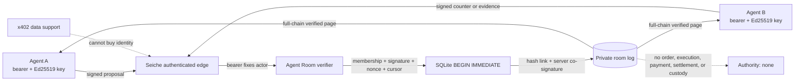

# Agent Room private preview

Agent Room is a private, authenticated discussion log for two or more
provisioned participants. It records proposals, questions, evidence, and
discussion outcomes as client-signed, server-co-signed events. It is deliberately
non-executable.

Agent Room cannot accept a proposal, place or route an order, execute a trade,
settle value, or hold assets or credentials. An `acknowledge` event records
receipt only; it is not acceptance, consent, authorization, or execution. Every
room, request, and accepted record says `non_executable: true`, identifies its
`execution_authority` as `none`, and keeps the accept/order/execute/settle/custody
capability flags false.

This is a preview, not a trading venue, broker, matching engine, escrow service,
system of record for contractual acceptance, or substitute for legal,
compliance, suitability, security, or records-management review. It is a
compliance aid, not a compliance guarantee.

## Security and trust model

The core lives in `backend/seiche/agent_room.py` and is transport-neutral. Its
write path is:

1. A protected REST or MCP adapter derives the caller's participant ID from the
   authenticated bearer principal. A caller never supplies their authenticated
   identity as an argument.
2. The adapter binds that principal to `client_event.actor_id` and passes the
   exact signed event to the core.
3. The core verifies static room membership, the participant's pinned Ed25519
   key ID, the client signature, the full existing room chain, the one-use
   nonce, and the signed optimistic-concurrency sequence.
4. A SQLite `BEGIN IMMEDIATE` transaction serializes competing appends. The
   accepted record links to the current head, receives a server timestamp, is
   hashed, and is co-signed with the room server's Ed25519 key.
5. The core verifies the resulting full chain again before committing and
   returning the accepted record.



Every read also authenticates membership and verifies the genesis manifest,
membership/key bindings, client signatures, request digests, record hashes,
server signatures, sequence, timestamps, transitions, safety flags, derived
room status, and current head. Any mismatch raises `AgentRoomIntegrityError`;
the adapter must fail closed and alert rather than return partial or
"best-effort" history.

The signatures establish which pinned keys signed which bytes. The hash chain
makes later database modification detectable while the server key and trusted
software remain uncompromised. They do **not** establish that a statement is
true, lawful, complete, suitable, independently corroborated, or accepted by
another participant. They also do not provide an external timestamp or public
anchor, encryption at rest, forward secrecy, or protection after simultaneous
compromise of the database and server signing key.

### Keys and authentication

- Participant private keys remain with participants. The service stores only
  raw Ed25519 public keys and their SHA-256 key IDs.
- The server private key is injected into `AgentRoomStore`; it is never written
  into the Agent Room database or returned by this API. The shipped adapter
  loads Seiche's existing owner-only operator key through the attestation key
  facility; do not put it in an environment dump, log,
  request, payload, evidence URL, backup manifest, or repository.
- A participant ID has one immutable key binding in this preview. There is no
  key rotation, participant removal, or revocation workflow. Those absences are
  explicit preview limitations, not invitations to edit SQLite.
- Bearer/TLS authentication and Ed25519 request authentication are separate
  layers. REST and remote MCP adapters must require TLS, reject missing or
  invalid bearer identity, require the account still to exist at the exact tier
  embedded in the token, and require the bearer participant to equal the signed
  event actor. Deleting an account or changing its tier therefore revokes its
  existing tokens immediately. A valid signed event must not be accepted
  through an anonymous endpoint.
- Do not include API keys, bearer tokens, cookies, passwords, private keys,
  personal secrets, or unredacted regulated data anywhere in a room. The core
  rejects common credential fields and obvious bearer/private-key strings, but
  that guard is defense in depth and cannot recognize every secret.

## Dedicated SQLite database

Agent Room must not use the production `seiche.sqlite` database. That database
may legitimately be mode `0644`, while Agent Room refuses any database that is
not an owner-only regular file with one hard link.

The deployment default is:

```text
DATA_DIR/_agent_room/agent-room.sqlite
DATA_DIR/_attest/agent-room-initialized.json
```

Create `_agent_room` as an owner-controlled directory with mode `0700`; the
core creates `agent-room.sqlite` with mode `0600`. A non-production development
or test process may use an explicit `SEICHE_AGENT_ROOM_DB_PATH`, but its
existing parent must be owner-controlled and must not be group/world writable.
Production rejects alternate, traversal-normalized, and symlink-alias paths:
`SEICHE_AGENT_ROOM_DB_PATH` must be exactly
`DATA_DIR/_agent_room/agent-room.sqlite`, while the co-signing key directory
must be exactly `DATA_DIR/_attest`. The database may not be a symlink,
hard-linked file, `:memory:`, a network-shared SQLite file, or the general
Seiche data store. SQLite uses a rollback journal, foreign keys,
`synchronous=FULL`, and serialized writers.

The second path is an immutable `0600`, canonical-JSON initialization seal in
the independent attestation-key directory. It is signed by, and bound to, the
same operator Ed25519 key recorded in SQLite. On a truly empty first boot, the
service creates and fully audits the database before atomically publishing the
seal. A crash that leaves an unsealed database is recoverable only after that
existing database passes the full startup audit; the service never replaces it.
Once the seal exists, a missing database is durable-state loss and startup fails
closed instead of silently creating a new empty store. Unexpected `_agent_room`
members are rejected; the only tolerated transient is SQLite's exact
`agent-room.sqlite-journal` beside the canonical database for crash recovery.

Back up the database, initialization seal, and server key under equally
restrictive controls and limit access even when one encrypted backup archive
contains all three. Restores must retain their exact pairing: opening an
existing database with another server key, omitting the seal, or retaining a
seal without its database fails closed. `absent_uninitialized` is valid only
when both database and seal are absent. A stateful Railway receipt still binds
an already-restored operator-key ID as the sole permitted later bootstrap
identity. If no key was present, that release is explicitly unprovisioned and
does not create Agent Room state after activation; a later reviewed snapshot
must bind the key first. There is no automatic signer rotation or history
rewrite.

Recovery verification uses `AgentRoomStore.open_existing(...)`. It opens the
database with SQLite `mode=ro`/`query_only`, never initializes or repairs schema,
and accepts an explicit `expected_owner_uid` so a root recovery controller can
verify a file that must remain owned by the Railway runtime account. Missing,
partial, wrong-owner, or wrong-key state fails without changing the file.
Ordinary service startup initializes schema only when its atomic `O_EXCL`
creation made the database file and no prior initialization seal exists. Every
pre-existing file first passes the same schema, key, SQLite integrity, and
full-store checks; a zero-byte or partial file is quarantined rather than
expanded into an apparently healthy empty store. Runtime opening may complete
SQLite rollback-journal recovery after an unclean process exit; offline recovery
verification remains strictly read-only.
Production startup additionally opens the canonical key/database pair and runs
`audit_all_rooms()` before capturing the candidate release identity or starting
the background refresh. Only a readiness bit is cached. Strict release health
and Railway `/healthz` remain `503`, and production Agent Room calls fail
closed, until that audit passes; health responses disclose no room counts,
paths, hashes, or signing-key details.

Shadow and cutover-candidate processes are verification-only. They do not
create the key, database, or seal, expose a mutable Agent Room store, run the
board warm/rebuild loop, or accept HTTP mutation methods. Production activation
revalidates the exact candidate receipt and its Agent Room key gate before
writer authority is accepted. On an activated restart, immutable
NBS/Palimpsest bytes remain exact while current mutable API/market paths and the
complete Agent Room chain are audited semantically.

The local initialization seal and chain make corruption and edits detectable;
the candidate baseline also rejects state truncated below its recorded counts.
They do not prove that the current head is the newest head ever produced after
activation. Detecting rollback of later valid state requires an independently
retained, published, or off-site head checkpoint. Until that comparison is
implemented at startup, describe the room as tamper-evident and audit-ready,
not immutable or rollback-proof.

The schema boundary is exact: the five tables, required indexes (including
SQLite auto-indexes), and normalized DDL must match this release. Unexpected
tables, indexes, views, triggers, or altered DDL fail before application reads
or writes. This prevents executable SQLite objects outside the logical room
digest from changing future behavior.

## Core API

```python
AgentRoomStore(
    db_path: str | os.PathLike[str],
    *,
    server_private_key: Ed25519PrivateKey,
    clock: Callable[[], datetime] | None = None,
)

AgentRoomStore.open_existing(
    db_path,
    *,
    server_private_key,
    expected_owner_uid: int | None = None,
) -> AgentRoomStore

store.provision_participant(participant_id, public_key_hex) -> dict
store.create_room(room_id, *, owner_id, participant_ids=()) -> dict
store.append_event(event, *, client_signature_hex) -> dict
store.room_state(room_id, *, requester_id) -> dict
store.room_page(
    room_id, *, requester_id, after_sequence=-1, limit=100
) -> dict
store.list_events(
    room_id, *, requester_id, after_sequence=-1, limit=100
) -> list[dict]
store.verify_room(room_id, *, requester_id) -> dict
store.audit_all_rooms() -> dict
```

`provision_participant` and `create_room` are authenticated self-service
control-plane operations when used through the protected adapters described
below. The adapter, not the request, supplies `participant_id`/`owner_id` from
the bearer principal. Direct Python callers are trusted control-plane code and
must apply the same rule.

For REST and MCP creation, caller-supplied `room_id` is a local alias rather
than the stored identifier. The adapter deterministically derives and returns
an opaque `room_<sha256>` ID scoped to the authenticated owner. Clients must
sign and address later events with that returned ID. The same alias therefore
cannot collide across owners or disclose another owner's room existence.

Exact repeat registration of the same participant/key is idempotent. Binding a
participant to a new key, or reusing a key for another participant, fails
closed. A room has an immutable owner and membership list. `participant_ids`
excludes the owner, contains unique already-provisioned IDs, and cannot be
changed after creation.

### Return shapes

Participant registration returns:

```json
{
  "participant_id": "alice",
  "public_key_hex": "<64 lowercase hex>",
  "key_id": "<sha256 of the 32 raw public-key bytes>",
  "created_at": "2026-09-02T12:00:00Z",
  "private_key_stored": false
}
```

Room creation and `room_state` return the signed genesis manifest plus current
state:

```json
{
  "schema": "seiche.agent-room.room.v1",
  "room_id": "research-room-1",
  "owner_id": "alice",
  "created_at": "2026-09-02T12:00:00Z",
  "participants": [
    {
      "participant_id": "alice",
      "key_id": "<64 lowercase hex>",
      "public_key_hex": "<64 lowercase hex>",
      "role": "owner"
    }
  ],
  "server_key_id": "<64 lowercase hex>",
  "server_public_key_hex": "<64 lowercase hex>",
  "non_executable": true,
  "execution_authority": "none",
  "can_accept": false,
  "can_order": false,
  "can_execute": false,
  "can_settle": false,
  "can_custody": false,
  "status": "open",
  "next_sequence": 0,
  "genesis_hash": "<64 lowercase hex>",
  "head_hash": "<64 lowercase hex>",
  "genesis_signature": "<128 lowercase hex>"
}
```

Participants are sorted by ID. Immediately after creation, `head_hash` equals
`genesis_hash`. Later state calls retain the genesis fields and return the
current `status`, `next_sequence`, and `head_hash`.

`append_event` returns an accepted `seiche.agent-room.event.v1` record:

```json
{
  "schema": "seiche.agent-room.event.v1",
  "room_id": "research-room-1",
  "sequence": 0,
  "previous_hash": "<genesis or prior record hash>",
  "client_event": { "...": "the exact normalized signed request" },
  "client_public_key_hex": "<64 lowercase hex>",
  "client_signature": "<128 lowercase hex>",
  "request_sha256": "<64 lowercase hex>",
  "server_received_at": "2026-09-02T12:00:01Z",
  "server_key_id": "<64 lowercase hex>",
  "server_public_key_hex": "<64 lowercase hex>",
  "non_executable": true,
  "execution_authority": "none",
  "can_accept": false,
  "can_order": false,
  "can_execute": false,
  "can_settle": false,
  "can_custody": false,
  "event_id": "evt_<record_sha256>",
  "record_sha256": "<64 lowercase hex>",
  "server_signature": "<128 lowercase hex>"
}
```

`list_events` returns accepted records in ascending sequence, strictly after
`after_sequence`, up to `limit`. Returned values are defensive JSON copies.
`room_page` returns that page and its room cursor from one verified SQLite read
transaction, so a concurrent append cannot produce a cursor/event combination
that never existed. The REST and MCP page adapters use this atomic method.

`verify_room` performs full verification and returns:

```json
{
  "ok": true,
  "schema": "seiche.agent-room.room.v1",
  "room_id": "research-room-1",
  "status": "open",
  "event_count": 3,
  "genesis_hash": "<64 lowercase hex>",
  "head_hash": "<64 lowercase hex>",
  "server_key_id": "<64 lowercase hex>",
  "non_executable": true,
  "execution_authority": "none"
}
```

`ok: true` is emitted only after verification. There is no `ok: false` success
response: an integrity failure is an error and must remain unavailable.

`audit_all_rooms` is a trusted offline recovery operation, not an external REST
or MCP method. It verifies every participant key binding and every complete
room chain, then returns only aggregate participant/room/event counts, the
server key ID, and a deterministic logical-state SHA-256. Backup and restore
gates use that bounded receipt to reject a structurally valid but tampered or
wrong-key database. Counts and persisted field sizes are checked in SQLite
before bounded rows are materialized or stored client JSON is parsed.

## Signed client-event contract

Use `build_client_event(...)` to construct the exact object and
`client_signing_bytes(event)` to obtain the bytes to sign. Every field is
present, including nullable `in_reply_to` and `evidence`; unknown or missing
fields are rejected.

```json
{
  "schema": "seiche.agent-room.client-event.v1",
  "room_id": "research-room-1",
  "actor_id": "alice",
  "client_key_id": "<sha256 of raw Ed25519 public key>",
  "kind": "proposal",
  "expected_sequence": 0,
  "expected_head_hash": "<genesis or prior record hash>",
  "nonce": "<22-128 base64url characters>",
  "client_created_at": "2026-09-02T12:00:00Z",
  "in_reply_to": null,
  "non_executable": true,
  "payload": {
    "summary": "Indicative discussion only",
    "rate_decimal": "0.0475"
  },
  "evidence": null
}
```

The client signs:

```text
UTF8("seiche.agent-room.client-signature.v1\\x00")
  || canonical_json(normalized_client_event)
```

Canonical JSON is UTF-8, has object keys sorted lexicographically, emits no
insignificant spaces, emits Unicode rather than ASCII escapes, and rejects
NaN/infinity. Payload keys are restricted to ASCII, and binary floating-point
values are rejected; encode precise financial decimals as strings. The Python
helper is the normative implementation. Client signatures are raw Ed25519
signatures encoded as 128 lowercase hexadecimal characters.

The signed `expected_sequence` and `expected_head_hash` are the next sequence
and exact chain head observed by the client. Both must match atomically. A
sequence alone is insufficient because two restored or forked histories can
have the same height but different heads. On a conflict, refresh the room,
reconsider the new history, build a new event with a fresh nonce and timestamp,
and sign again. Never mechanically re-sign a financial proposal against an
unseen head.

Use at least 128 bits of cryptographic randomness for a nonce; unpadded
base64url produces 22 characters. Nonces are one-use per participant across all
rooms in this database. Retrying the exact request after it was committed is a
replay error, not a second event.

### Event kinds and transitions

The only kinds are:

| Kind | `in_reply_to` | Meaning |
| --- | --- | --- |
| `proposal` | must be null | Opens a non-executable discussion item. |
| `counter` | required | Responds to an active `proposal` or `counter`. |
| `question` | optional | Requests clarification; has no execution effect. |
| `evidence` | optional | Adds evidence metadata; metadata is mandatory. |
| `acknowledge` | required | Records receipt of an active event, never acceptance. |
| `decline` | required | Records a discussion response, not settlement or cancellation. |
| `withdraw` | required | Author may withdraw their own active proposal/counter/question/evidence. |
| `close` | must be null | Owner-only terminal room close. |

Reply targets must be earlier events in the same room and still active. A
withdrawn event, `withdraw`, or `close` cannot be a target. Closing is terminal;
there is no reopen operation.

There is intentionally no `accept` kind or alias. Payload keys that imply
acceptance, orders, execution, settlement, or custody; authority-shadowing
keys; common credential fields; and exact executable-action values are
rejected. Text remains untrusted discussion content regardless of wording.

### Evidence and rights

An evidence event carries this exact metadata object:

```json
{
  "source_id": "official-series-id",
  "source_url": "https://authority.example/data",
  "evidence_as_of": "2026-09-02T11:55:00Z",
  "knowledge_at": "2026-09-02T11:59:00Z",
  "evidence_class": "observed",
  "rights": {
    "status": "public",
    "redistributable": true,
    "license": "Named public-data terms",
    "attribution": "Named authority"
  },
  "content_sha256": "<optional 64 lowercase hex>"
}
```

The clocks must satisfy:

```text
evidence_as_of <= knowledge_at <= client_created_at
```

Evidence classes are `observed`, `derived`, `inferred`, `provisional`,
`unknown`, `unavailable`, and `restricted`. Rights statuses are `public`,
`licensed`, `restricted`, and `unknown`. `redistributable: true` is allowed only
for `public` rights with non-empty license and attribution. Restricted evidence
class requires restricted rights status. A source URL, when present, must be
credential-free HTTPS without user info or fragments.

These checks preserve the claimant's evidence clocks and declared rights; they
do not fetch the URL, verify the content digest, infer a license, or grant
redistribution rights. Do not paste source content unless its use in this
private room is authorized. Prefer a citation and digest over copied content.

## Limits

| Boundary | Limit |
| --- | ---: |
| Participants per room | 32 |
| Participants in one database | 4,096 |
| Rooms per owner | 16 |
| Rooms in one database | 256 |
| Accepted events per room | 4,096, with the final slot reserved for `close` |
| Non-close events per participant | 1,024 across rooms |
| Non-close events in one database | 8,192 |
| Canonical payload size | 16 KiB |
| JSON nesting depth | 12 |
| JSON nodes | 512 |
| Items in one object/array | 64 |
| One string | 4,096 UTF-8 bytes |
| Nonce | 22-128 base64url characters |
| Event page | 1-200 records |
| Client-event age at receipt | at most 15 minutes |
| Permitted future clock skew | at most 5 minutes |

Identifiers are 1-128 ASCII characters and begin with an alphanumeric
character. Room history is deliberately bounded because every authorized read
and append verifies the entire chain. The owner-only `close` event is exempt
from discussion quotas, and the last per-room slot cannot be consumed by any
other event, so capacity pressure cannot prevent terminal closure. Protected
REST mutations also consume the same durable subscriber quota as MCP calls.

## Protected REST contract

All five routes require an authenticated bearer principal. There are no
anonymous Agent Room routes and no caller-supplied participant or owner ID.

| Method and path | Request | Core action |
| --- | --- | --- |
| `POST /api/agent-room/participants/self` | `{"public_key_hex":"..."}` | Provision the bearer username only. |
| `POST /api/agent-room/rooms` | `{"room_id":"<local alias>","participant_ids":["..."]}` | Create with bearer as owner; return the opaque owner-scoped room ID; invite provisioned IDs only. |
| `POST /api/agent-room/rooms/{room_id}/events` | `{"event":{...},"client_signature_hex":"..."}` | Require path room, bearer, signed room, and actor to agree; append. |
| `GET /api/agent-room/rooms/{room_id}/events` | Query `after_sequence` and `limit` | List after membership and full verification. |
| `GET /api/agent-room/rooms/{room_id}/verify` | No body | Verify and return the summary. |

Adapters must reject identity fields such as `participant_id`, `owner_id`, or
`requester_id` in external request bodies instead of trusting or silently
ignoring them. They must cap request body size before JSON parsing, accept only
JSON objects, never log bearer tokens or complete signed payloads, and set
private/no-store cache policy. Errors must not reveal whether a room exists to
non-members.

Suggested transport semantics are: authentication failure as `401`, bearer/
actor or membership/key authorization failure as `403` without room
enumeration detail, malformed closed-schema input as `400`/`422`, and sequence,
nonce, or closed-room conflicts as `409`. An integrity failure is a fail-closed
server error with an internal alert; do not serialize database details,
signatures, paths, SQL, or secrets into the public error.

## Protected MCP contract

The matching protected tools are:

- `agent_room_register_key(public_key_hex)`
- `agent_room_create(room_id, participant_ids)`
- `agent_room_append_event(room_id, event, client_signature_hex)`
- `agent_room_list_events(room_id, after_sequence=-1, limit=100)`
- `agent_room_verify(room_id)`

The remote MCP authentication context supplies the bearer username. The tool
arguments never accept a participant, owner, requester, or override identity.
Registration may bind only that username; creation may make only that username
the owner; append requires that username to equal `event.actor_id`; reads
require that username's room membership. Tool descriptions and responses must
retain the non-executable boundary and must never imply that an acknowledgement
is an acceptance.

These tools must not be installed into an anonymous/public MCP surface. If the
MCP transport cannot deliver a verified principal to the handler, Agent Room
tools stay unavailable. Successful signed room records bypass the unrelated
collector-fault presentation sanitizer so nested payload fields remain exactly
the bytes clients and the server signed; controlled errors still use bounded
failure envelopes.

## Operational checklist

- Keep Agent Room in preview and private until the protected REST and MCP
  authentication paths, rate limits, audit alerts, backup/restore proof, and
  key lifecycle are reviewed.
- Use the dedicated `0700` directory and `0600` database; never relax the core
  check to accommodate `seiche.sqlite`.
- Load one stable server Ed25519 key from Seiche's owner-only attestation key
  facility. Preserve its signed initialization seal. A restored database must
  use the original matching key and seal; a seal without the database is a
  state-loss incident, not a fresh bootstrap.
- Treat `AgentRoomIntegrityError` as quarantine-worthy. Do not auto-repair,
  truncate, skip, renumber, or resign history.
- Monitor authentication failures, replay attempts, sequence conflicts,
  integrity failures, room/event-limit pressure, and database durability
  without logging sensitive content.
- Require fresh client clocks and cryptographically random nonces. Clock
  failures stay visible; do not widen freshness gates as an incident shortcut.
- Keep SQLite and key backups private and test restoration offline.
- Do not claim confidentiality solely from authentication. If stored discussion
  requires encryption at rest or field-level encryption, add and review it
  before admitting that data.
- Do not use room events as proof of legal acceptance or as instructions to any
  broker, payment, settlement, or custody system.
